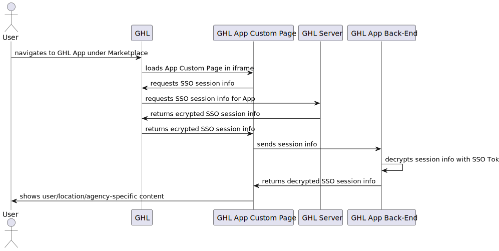

# `@cbnsndwch/ghl-app-template`

A base template for full-stack HighLevel Marketplace apps

## Table of Contents

- [Getting Started](#getting-started)
- [Usage](#usage)
- [API Routes](#api-routes)
- [SSO Integration](#sso-iframe-integration)
- [License](#license)

## Getting Started

> &nbsp;
> :warning: This project requires a recent version of NodeJS installed on your
> machine. The current Active LTS version is NodeJS 20.x and a transition to
> NodeJS 22.x is expected on November of 2024.
>
> You should be OK using NodeJS 18.x until the end of the maintenance period in
> April 2025 but I will not be offering support for it.
>
> For more information on NodeJS LTS releases, see the [NodeJS Release Schedule].
> &nbsp;

Create a new repository from this template

<a href="https://github.com/new?template_name=ghl-app-template&template_owner=cbnsndwch">
  
</a>

Then, clone your new repository on your dev machine and install the dependencies:

```shell
git clone https://github.com/{YOUR_GITHUB_USERNAME}/ghl-app-template
cd ghl-app-template
yarn
```

Open the directory in VSCode:

```shell
code .
```

To start the development server with the debugger attached run the `Debug API` launch configuration. Alternatively, change to the `apps/server` directory and run the following command:

```shell
yarn dev
```

## Usage

Work in progress...

## API Routes

Work in progress...

## SSO (iframe integration)

This section illustrates the process of authenticating a user in the context of a GHL Marketplace App's Custom Pages, by using the new GHL SSO feature. The SSO flow works as follows:

1. The user navigates to the GHL App under the Marketplace menu.
2. The GHL App loads the Custom Page in an iframe.
3. The Custom Page requests the SSO session info from the GHL App by sending a cross-frame message.
4. The GHL App requests the SSO session info from the GHL Server, passing the app's Client ID.
5. The GHL Server uses the app's SSO Token to encrypt the SSO session info and returns it to the GHL App.
6. The GHL App returns the encrypted SSO session info to the Custom Page by sending a response cross-frame message.
7. The Custom Page sends the encrypted SSO session info to the Marketplace App's back-end. The back-end decrypts the SSO session info using the app's SSO Token. Perform app-specific autjorization logic here, like checking if the user, location, or agency is allowed to access the Marketplace.
8. The back-end returns the decrypted SSO session info to the Custom Page along with any relevant app-specific data.
9. The Custom Page now has access to the user's SSO session info and can use it to show content or provide functionality that is user-, location-, or agency-specific.



For a reference implementation see the code in `apps/server/public/js/ghl.mjs`.

## License

This project is licensed under the [MIT License](LICENSE.md).

[NodeJS Release Schedule]: https://nodejs.org/en/about/previous-releases
